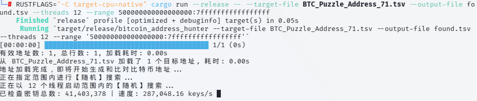
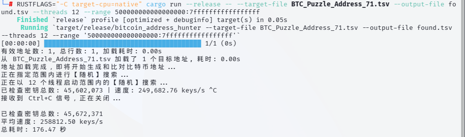

# Finding a needle in a haystack
Finding New Worlds！

This is a multi-threaded Bitcoin private key search program that uses CPU multi-threaded calculations to generate and verify random private keys, and searches in a random manner. This program can be used to test the collision probability of Bitcoin addresses or related research. (Note: Please try to run it on Linux.)

## RUST(This version is recommended.)

# Instructions

    cargo run --release -- --target-file BTC_Puzzle_Address_71.tsv --output-file found.tsv --threads 8 --range 500000000000000000:7fffffffffffffffff

    #Let the compiler generate the most optimized instruction set (e.g., AVX2, AVX-512, etc.) for the CPU you are using, which can improve stability.
    RUSTFLAGS="-C target-cpu=native" cargo run --release -- --target-file BTC_Puzzle_Address_71.tsv --output-file found.tsv --threads 12 --range 500000000000000000:7fffffffffffffffff

# Thank you for your use
Support me!

    BTC：
    
    bc1q8np6jeglpgju7ex5z6mvsmllzwhxqzytymwlv7
    
    LTC：
    
    LTzSaAtCvAhjRYJHSFPjmqustpYRCypXxL
    
### (USDT、USDC)
    
    TRC20:
    TXdmK7Dd5UjWbfutoiHDGLBub4hYjbWteg
    
    Arbitrum One:
    0xceF4D9ae284AB6f836dB20C851c3631fe2eCCc72
    
    Aptos：
    0x3f7d7a503dcd26915d93af18f3deaf7108a29b7e517e627782882d313835f00b
    

